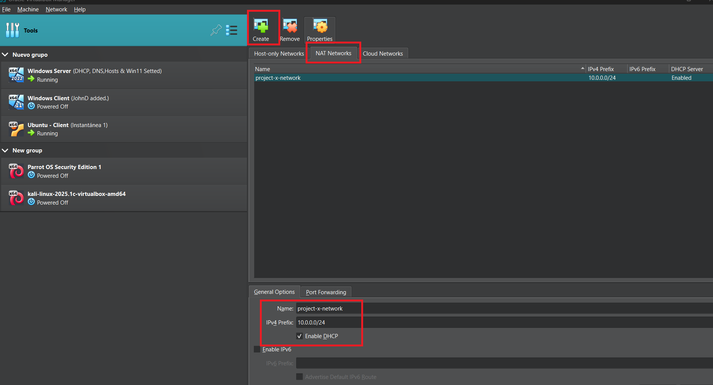

# HomeLab v2

# Descripción

Esta documentación muestra el paso a paso de distintas configuraciones simulando una red empresarial con el uso de máquinas virtuales. Muestra estrategias y el uso de herramientas con las que se enfrentaron distintos retos.  

# Objetivo

Poner en práctica conocimiento teórico, aplicando el uso de herramientas tanto para Seguridad como para Infraestructura y redes:

- Configurar medidas de seguridad
- Probar ataques y ver respuesta de las defensas
- Setear un espacio de produccion local, implementar automatizaciones y flujos de produccion.

Documentar el armado y configuraciones por sección como prueba de conocimiento y experiencia.

# Topología

Esta parte explica como se estructuró la red, que herramientas se usaron, como y por qué. La descripción del paso a paso está linkeado en cada titulo.

## **La red consta de:**

[Firewall (PFsense)](docs/Firewall-PFsense/README.md)

### **Zona Servidores DMZ/ VLAN 10:**

[Windows Server como Active Directory, DNS y DHCP](docs/Windows-Server-AD-DNS-DHCP/README.md)

[Servidor de Seguridad con Wazuh Manager](docs/Wazuh-Security-Server/README.md)

[Servidor Linux de Produccion (con servicios en Docker) ](docs/Servidor-Linux-Produccion/README.md)

### Zona Usuarios (LAN/VLAN 20)

- Terminal Host con Windows 11 (y Agente Wazuh)
- Terminal Host Sec linux
- Terminal atacante con Kali

# VirtualBox

Contamos con 8 nucleos (16 buses) y 48 gb de Ram para distribuir entre las maquinas.

1. Instalar [VirtualBox](https://www.virtualbox.org/).
2. Crear una red para el proyecto:
    - Acceder a las redes y en la parte de "Nat networks" crear una nueva y modificar el nombre y rango IP.
        
        
        
3. Configurar las Distintas MV (*Links en "[Topología](#topología)"*)
