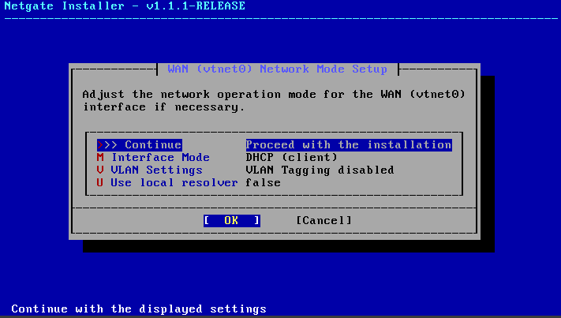

# Firewall (PFsense)

Que es PfSense y que rol cumple?

Es una distribución de software basada en FreeBSD diseñada para funcionar como Firewall y router.

Opera como la primer linea de defensa de nuestro HomeLab.

# Instalación de PfSense como MV:

## PreRequicitos

- Almacenamiento: 16 gb
- Arquitectura de 64 bits habilitada en la vm.
- Memoria: minimo 4 Ram
- Doble adaptador de Red habilitado. Uno para recibir internet como WAN y otro para distribuirlo a nuestra red LAN.

## Pasos

Cargar la maquina virtual.

Seleccionar la interfase y continuar:

Seleccionar vtnet para LAN y proceder con los cambios.  El instalador  va a terminar de copiar los archivos y va a pedir rebootear. 

Seleccionamos vtnet1 para LAN

Seleccionamos vtnet0 para WAN

Ni bien rebootee, hay que sacar la ISO de pfsense de la unidad virtual de Vbox yendo a la configuración → almacenamiento → click derecho en el disco y "Remover".

Una vez instalado, al rebootear se va a mostrar el menu de opciones:

Seleccionamos la opcion 2 para cambiar la IP LAN (op 2) por la de nuestra red virtual del HomeLab usando:

- **Ip**: 10.0.10.1
- **Mascara**: 24
- Gateway y ipv6: vacios (enter)
- **DHCP**:
    - Rango inicial: 10.0.10.100
    - Rango final: 10.0.10.200

Quedando el WAN y el LAN configurados.

[Ahora configurar el Servidor de Windows](../Windows-Server-AD-DNS-DHCP/README.md) antes de seguir con las demás configuraciones.

# En Windows Server:

Asegurarse que la Red esté conectado a la red interna:

Dentro de Centro de redes y recursos compartidos, asegurarse que el servidor tenga la Ipv4 configurada acorde:

- **IP**: 10.0.10.2
- **Subnet**: 255.255.255.0
- **Default gateway:** 10.0.10.1

Una vez en **[Windows Server](../Windows-Server-AD-DNS-DHCP/README.md),** abrir un browser y poner la IP del router firewall e ingresar con cuenta y contraseña: admin y pfsense.

Dentro de Pfsense vamos a configurar lo siguiente

- Primary DNS: 8.8.8.8
- Secondary DNS: 1.1.1.1

- Time Server: -
- WAN interface: DHCP

y Desmarcar las casillas:

El resto de las configuraciones como PPTP/PPPoE, DHCP, IP, vamos a ignorarlos, El router principal del ISP se encarga de lo necesario.

Por ultimo seteamos una contraseña (Ej: *pfsenseadmin)*

Ya debería haber quedado configurado. Podemos ir a la parte de "diagnosticos" en la barra superior y hacer Ping a google.com

*"0% packet loss"*, **Success!**

## VLANs
Ingresando por web a 10.0.10.1 ingresamos al GUI de pfsense.
Dentro de "Interfaces" vamos a "Assignments"
Acá vamos a encontrar "WAN" y "LAN" y debajo "Available netwaork ports". Tenemos que dar a "Add" para cada uno y se les van a asignar de nombre OPT1 y OPT2.
Una vez agregados, hacemos click en cada uno y marcamos "Enable Interface", cambiamos los nombres, configuramos IPV4 estatica y damos a "Save" abajo y luego "Apply" arriba

### Reglas
Por defecto, las nuevas interfaces van a tener bloqueado todo hasta que creemos una regla en pfsense:
1. Vamos a "Firewall" -> Rules -> elegimos las interfaces nuevas
2. agregamos una nueva donde:
    - Action: Pass
    - Protocol: Any
    - source: DEV_VLAN subnets (o la interfaz en cuestion)
    - Destination: any
  
3. Damos a "Save" y desp a "Apply"

### DHCP Relay
Para que los equipos que estén en VLANs distintas a las de nuestro [Windows Server DHCP](docs/Windows-Server-AD-DNS-DHCP/README.md), para que estos puedan recibir una IP,necesitamos configurar el Relay para que cuando el router reciba el pedido pueda direccionarlo al servidor responsable.
Arriba en "Services" damos a "DHCP Relay. Dentro de esta pantalla, vamos a ver las Interfaces que acabamos de configurar y seteamos en "Upstram Servers" la IP del Windows Server (10.0.10.2)

Es necesario tener los Scopes configurados en [Windows Server como Active Directory, DNS y DHCP](docs/Windows-Server-AD-DNS-DHCP/README.md)

  

