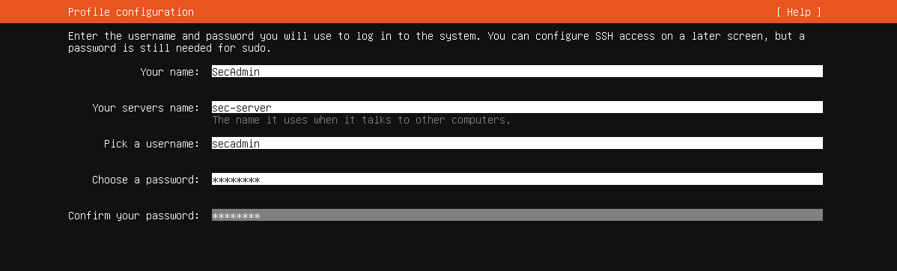

# Servidor de Seguridad con Wazuh Manager

Instalamos Ubuntu server

pass: secadmin

Instalamos ssh, pero ignoramos las opciones de snaps.

Chequeamos la ip asignada usando `ip add`

## Windows Server:

Abrimos una terminal de powershell como administrador y nos conectamos via ssh con:

- ssh secadmin@10.0.10.100

Navegamos a Wazuh, vamos a descargas y ejecutamos los comandos de instalación.

Cuando la instalación termine, nos da una cuenta y contraseña para acceder desde el navegador.

Ahora queda configurar los agentes en:

- [Windows Server AD](../Windows-Server-AD-DNS-DHCP/README.md)
- Windows 11 Host
- Linux Server de Produccion.
