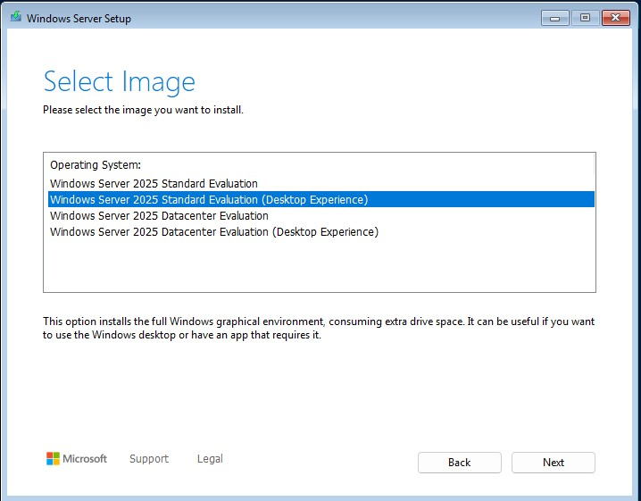

# Windows Server como Active Directory, DNS y DHCP

# Instalación

> **Configuracion de Specs:**
> 
> - Asegurarse de contar con por lo menos 2 CPU / 4096 MB y 50 GB de almacenamiento mínimo.
> - Corroborar en la configuración de la pantalla tener habilitada la aceleración 3D

Una vez comenzada la máquina virtual consultará estipular un lenguaje y una opción de setup.

Luego, al momento de seleccionar una imagen se puede usar la versión con o sin escritorio gráfico (GUI). En este caso elegimos la versión Desktop (con GUI)

Seleccionamos  "Crear una partición" aceptando el tamaño que viene por default.

<aside>
⚠️

Si al iniciar la pantalla permanece en Negro, asegurate tener Habilitada la Aceleración 3D en la configuracion de la maquina en la parte de "Pantalla"

</aside>

E instalar

Una vez iniciada por primera vez, solicitará ingresar una contraseña

Para ingresar luego, pedirá ctl+alt+del, dado que es una maquina virtual, esto se hace desde  "entrada" → Teclado →Insertar "ctrl+alt+sup".

# Configuraciones

Despues de la instalacion es importante asignar una IP fija que le permita el servidor comunicarse

Pese a que vayamos a activar en este servidor un servicio DHCP, el mismo necesita tener una IP fija para que el router lo pueda encontrar siempre y la red no caiga.

## Capa de Identidad

Hay tres roles que queremos que cumpla este servidor:

- **Active Directory (AD):** Maneja los Usuarios y permisos
- **Domain Name System (DNS):** funciona como lista de direcciones y nombres de las paginas a las que pueden acceder los usuarios.
- **DHCP (Dynamic Host Configuration Protocol):** es el protocolo que se encarga de asignar IPs dinamicamente a los distintos dispositivos.

## AD & DNS

Seleccionamos los roles de DNS, DHCP y AD DS.

y damos a continuar con las opciones por default hasta llegar a la opción de instalar.

Una vez instalados, vamos a la vandera arriba a la derecha y promovemos el servidor como **controlador de dominio**:

Agregamos como new forest y asignamos un nombre de dominio

Luego en Opciones asignamos una contraseña. Por ahora vamos a saltear las opciones de DNS y demás configuraciones, dejando las opciones default.

El servidor se va a reiniciar automaticamente, y luego, para entrar ya no vamos a poner solo "Administrador", sino **`LAB\Administrador`**.

## DHCP

Abrimos "tools" y seleccionamos DHCP

Desplegar el nombre del servidor y autorizar en IPv4 y refrescamos hasta que el punto rojo pase a verde.

Ahora, haciendo click derecho sobre IPv4 seleccionamos "New Scope"

y completamos:

- **Nombre:** `Red_Local`.
- **Rango:** Inicial `10.0.10.100` / Final `10.0.10.200`.
- **Máscara:** `24` (o `255.255.255.0`).

y seguimos hasta llegar a la casilla "Si, quiero configurar estas opciones ahora"  y configuramos:

Router (Default gateway): 10.0.10.1 - La Ip del router

Dado que configuramos ya el DHCP en el servidor, es importante asegurarse que el DHCP del router está apagado

## Scopes para las VLANs
Tenemos que asegurarnos de también tener un scope para cada VLAN. Abajo muestro la configuracion para 10.0.20. pero sería similar para las demás que creemos.
1. Tools -> DHCP
2. desplegar a la izq en el nombre de la maquina y hacer click derecho en IPV4
3. Seleccionar "New Scope"
   Para DEV:
     - Ip Start / End: 10.0.20.100 10.0.20.200
     - Default Gateway: 10.0.20.1 (eS EL pfSense en esa VLAN)
     - DNS: 10.0.10.2 (El Windows server mismo)
   Para el DMZ:
     - Ip Start / End: 10.0.30.100 10.0.30.200
     - Default Gateway: 10.0.30.1 (eS EL pfSense en esa VLAN)
     - DNS: 10.0.10.2
   

## Wazuh Agent

Una vez seteado Wazuh Manager en el [Servidor de Seguridad](../Wazuh-Security-Server/README.md), podemos instalar u agente dentro del AD.

1. Seleccionamos dentro del Wazuh management la opcion: "Deploy new Agent"
2. Completamos con la IP del Linux sec server 10.0.10.100 y asignamos un nombre (ej. WA-01)
3. Mas abajo nos va a dar un comando para correr en powershell como admin, y así instalarlo.
4. y por ultimo el comando para iniciarlo
